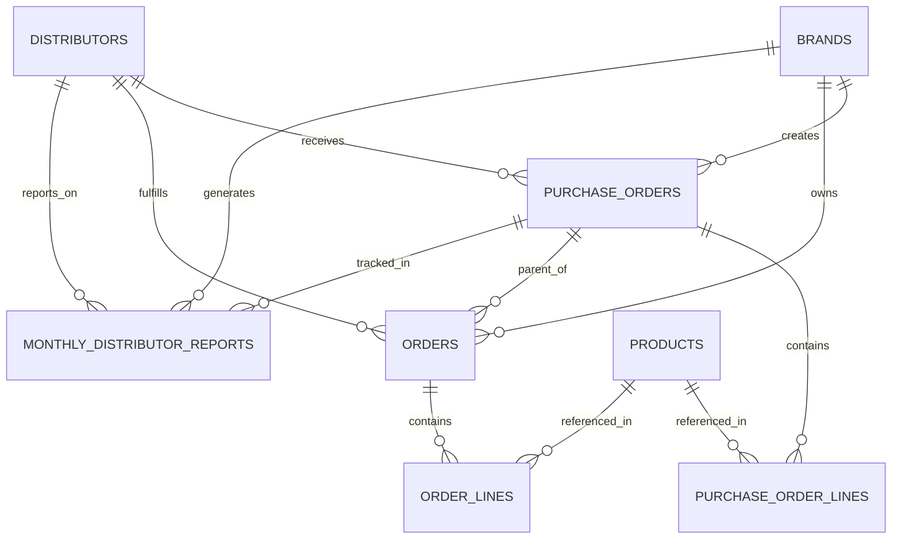
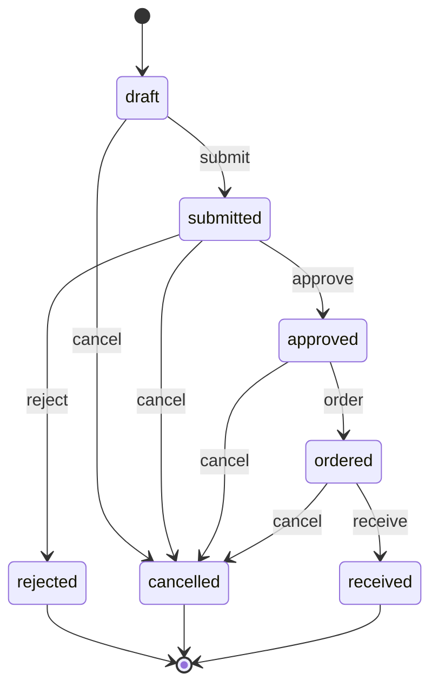
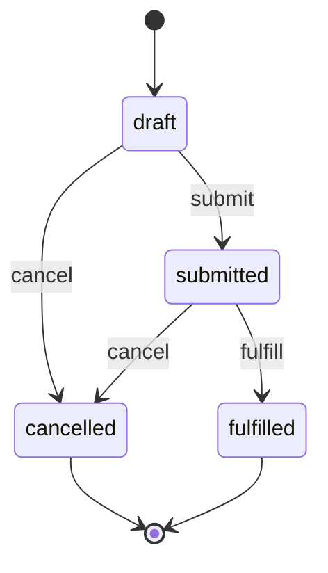

# Purchase Orders → Orders → Monthly Reporting: Implementation Guide

**Date:** November 18, 2025  
**Version:** 1.0  
**Status:** ✅ Implementation Complete

---

## Table of Contents

1. [Overview](#overview)
2. [Data Model](#data-model)
3. [Workflow State Machines](#workflow-state-machines)
4. [API Endpoints Reference](#api-endpoints-reference)
5. [Database Migrations](#database-migrations)
6. [Implementation Details](#implementation-details)
7. [Usage Examples](#usage-examples)
8. [Testing Guide](#testing-guide)

---

## Overview

This implementation establishes a parent-child relationship between Purchase Orders (POs) and Orders, with monthly distributor reporting capabilities. The system enforces that:

1. **Purchase Orders** are created and approved by Brand/Manufacturer for a Distributor
2. **Orders** can be created under approved POs (or independently for backward compatibility)
3. **Monthly Reports** aggregate order data by brand, distributor, and optionally by PO

### Key Benefits

- **Data Integrity:** Orders linked to POs maintain referential integrity
- **Workflow Control:** POs must be approved before creating child orders
- **Performance Reporting:** Automated monthly metrics with fill rate calculations
- **Scalability:** Normalized line items enable efficient querying and aggregation

---

## Data Model

### Entity Relationship Diagram



### Core Tables

#### **purchase_orders**

Parent entity representing approved procurement requests.

| Column | Type | Constraints | Description |
|--------|------|-------------|-------------|
| `id` | UUID | PK | Unique identifier |
| `brand_id` | UUID | FK, NOT NULL | Brand creating the PO |
| `distributor_id` | UUID | FK, NULL | Target distributor |
| `po_status` | ENUM | NOT NULL | draft, submitted, approved, rejected, ordered, received, cancelled |
| `submitted_at` | TIMESTAMPTZ | NULL | When submitted for approval |
| `approved_at` | TIMESTAMPTZ | NULL | When approved |
| `approved_by` | UUID | FK | User who approved |
| `items` | JSONB | NOT NULL | Legacy items array |
| Created in migrations `002`, `004`, `019`

#### **purchase_order_lines** ✨ NEW

Normalized line items for POs.

| Column | Type | Constraints | Description |
|--------|------|-------------|-------------|
| `id` | UUID | PK | Unique identifier |
| `purchase_order_id` | UUID | FK, NOT NULL | Parent PO |
| `product_id` | UUID | FK, NULL | Product reference |
| `sku` | VARCHAR(100) | NOT NULL | Product SKU |
| `product_name` | VARCHAR(255) | NULL | Product name |
| `quantity` | NUMERIC(10,2) | CHECK >= 0 | Quantity ordered |
| `unit_price` | NUMERIC(10,2) | CHECK >= 0 | Price per unit |
| `total` | NUMERIC(10,2) | GENERATED | quantity * unit_price |
| `currency` | VARCHAR(3) | DEFAULT 'USD' | Currency code |
| Migration: `031_create_purchase_order_lines_table.sql`

#### **orders**

Child entity representing actual sales/shipments.

| Column | Type | Constraints | Description |
|--------|------|-------------|-------------|
| `id` | UUID | PK | Unique identifier |
| `brand_id` | UUID | FK, NOT NULL | Brand owning the order |
| `distributor_id` | UUID | FK, NULL | Fulfilling distributor |
| **`purchase_order_id`** | **UUID** | **FK, NULL** | **✨ NEW: Parent PO** |
| `order_status` | ENUM | NOT NULL | pending, confirmed, processing, shipped, delivered, cancelled |
| `items` | JSONB | NOT NULL | Legacy items array |
| `total_amount` | NUMERIC | CHECK >= 0 | Total order value |
| Modified in migration: `033_add_purchase_order_id_to_orders.sql`

#### **order_lines** ✨ NEW

Normalized line items for orders.

| Column | Type | Constraints | Description |
|--------|------|-------------|-------------|
| `id` | UUID | PK | Unique identifier |
| `order_id` | UUID | FK, NOT NULL | Parent order |
| `product_id` | UUID | FK, NULL | Product reference |
| `sku` | VARCHAR(100) | NOT NULL | Product SKU |
| `product_name` | VARCHAR(255) | NULL | Product name |
| `quantity` | NUMERIC(10,2) | CHECK >= 0 | Quantity ordered |
| `unit_price` | NUMERIC(10,2) | CHECK >= 0 | Price per unit |
| `discount` | NUMERIC(10,2) | DEFAULT 0 | Discount amount |
| `tax` | NUMERIC(10,2) | DEFAULT 0 | Tax amount |
| `total` | NUMERIC(10,2) | GENERATED | (quantity * unit_price) - discount + tax |
| Migration: `032_create_order_lines_table.sql`

#### **monthly_distributor_reports** ✨ NEW

Aggregated monthly performance metrics.

| Column | Type | Constraints | Description |
|--------|------|-------------|-------------|
| `id` | UUID | PK | Unique identifier |
| `brand_id` | UUID | FK, NOT NULL | Brand generating report |
| `distributor_id` | UUID | FK, NOT NULL | Distributor being reported |
| `purchase_order_id` | UUID | FK, NULL | Optional: PO-specific report |
| `report_month` | DATE | NOT NULL | First day of month (YYYY-MM-01) |
| `total_orders` | INTEGER | DEFAULT 0 | Count of orders |
| `total_units` | NUMERIC(12,2) | DEFAULT 0 | Sum of units sold |
| `total_sales` | NUMERIC(14,2) | DEFAULT 0 | Sum of order totals |
| `fill_rate` | NUMERIC(5,2) | 0-100 | % of PO quantity fulfilled |
| `avg_order_value` | NUMERIC(12,2) | DEFAULT 0 | Average order value |
| `status` | ENUM | NOT NULL | draft, submitted, confirmed, archived |
| UNIQUE | (brand_id, distributor_id, report_month, purchase_order_id) | | Prevents duplicates |
| Migration: `034_create_monthly_distributor_reports_table.sql`

---

## Workflow State Machines

### Purchase Order Workflow

**States:** `draft` → `submitted` → `approved` → `ordered` → `received`

**Transitions:**



**Implemented in:** `lib/po/workflow-engine.ts`

**Key Functions:**
- `isValidTransition(currentStatus, targetStatus, action)` - Validate transitions
- `checkPermission(userId, poId, action)` - Authorization checks
- `executeTransition(poId, userId, action, comments)` - Perform state change

### Order Workflow ✨ NEW

**States:** `draft` → `submitted` → `fulfilled`

**Transitions:**



**Implemented in:** `lib/orders/workflow-engine.ts`

**Key Functions:**
- `isValidTransition(currentStatus, targetStatus, action)` - Validate transitions
- `validateOrderAgainstPO(orderId, purchaseOrderId)` - PO constraint validation
- `validateNewOrderWithPO(orderData)` - Pre-insert validation
- `executeOrderTransition(orderId, userId, action, notes)` - Perform state change

**Validation Rules for PO-linked Orders:**
1. PO must exist
2. PO status must be `approved` or `ordered`
3. Order `brand_id` must match PO `brand_id`
4. Order `distributor_id` must match PO `distributor_id` (if PO has distributor)

---

## API Endpoints Reference

### Purchase Orders

#### Create Order from PO

**Endpoint:** `POST /api/purchase-orders/[id]/create-order`

**Description:** Creates a new order linked to an approved purchase order. Pre-populates brand, distributor, and line items from the PO.

**Authentication:** Required

**Request Body:**
```json
{
  "customer_name": "ABC Retail Store",
  "customer_email": "contact@abcstore.com",
  "customer_phone": "+1-555-0123",
  "notes": "Rush order",
  "shipping_address": {
    "line1": "123 Main St",
    "line2": "Suite 100",
    "city": "New York",
    "state": "NY",
    "zip_code": "10001",
    "country": "USA"
  }
}
```

**Success Response (201):**
```json
{
  "success": true,
  "order": {
    "id": "uuid",
    "order_number": "ORD-DIST-00123",
    "purchase_order_id": "po-uuid",
    "brand_id": "brand-uuid",
    "distributor_id": "dist-uuid",
    "order_status": "draft",
    "total_amount": 1500.00,
    ...
  },
  "message": "Order created successfully from purchase order"
}
```

**Error Responses:**
- `401` Unauthorized
- `403` Forbidden (no access to PO)
- `404` Purchase order not found
- `400` PO not approved/ordered

**Implementation:** `app/api/purchase-orders/[id]/create-order/route.ts`

---

### Monthly Reports

#### Get Reports

**Endpoint:** `GET /api/reports/monthly`

**Description:** Fetch monthly distributor reports with optional filters.

**Authentication:** Required

**Query Parameters:**
- `brand_id` (string, optional) - Filter by brand (super admin only)
- `distributor_id` (string, optional) - Filter by distributor
- `month` (string, optional) - Filter by month (YYYY-MM-DD)
- `purchase_order_id` (string, optional) - Filter by PO
- `status` (string, optional) - Filter by report status
- `limit` (integer, default: 50) - Pagination limit
- `offset` (integer, default: 0) - Pagination offset

**Success Response (200):**
```json
{
  "reports": [
    {
      "id": "uuid",
      "brand_id": "brand-uuid",
      "distributor_id": "dist-uuid",
      "purchase_order_id": "po-uuid",
      "report_month": "2025-11-01",
      "total_orders": 42,
      "total_units": 1250.50,
      "total_sales": 45000.00,
      "fill_rate": 87.5,
      "avg_order_value": 1071.43,
      "status": "confirmed",
      "generated_at": "2025-11-18T10:30:00Z",
      "distributors": { "name": "ABC Distributors" },
      "brands": { "name": "XYZ Brand" }
    }
  ],
  "total": 42,
  "limit": 50,
  "offset": 0
}
```

**Implementation:** `app/api/reports/monthly/route.ts`

#### Generate Report

**Endpoint:** `POST /api/reports/monthly/generate`

**Description:** Generate monthly distributor report(s) on-demand.

**Authentication:** Required

**Request Body:**
```json
{
  "brandId": "brand-uuid",
  "distributorId": "dist-uuid",
  "month": "2025-11-01",
  "purchaseOrderId": "po-uuid",  // Optional
  "batch": false  // If true, generates for all distributors
}
```

**Success Response (200):**
```json
{
  "success": true,
  "report": {
    "id": "uuid",
    "brand_id": "brand-uuid",
    "distributor_id": "dist-uuid",
    "report_month": "2025-11-01",
    "total_orders": 42,
    "total_units": 1250.50,
    "total_sales": 45000.00,
    "fill_rate": 87.5,
    "status": "draft",
    ...
  },
  "message": "Report generated successfully"
}
```

**Batch Response (when `batch: true`):**
```json
{
  "success": true,
  "reports": [ /* array of reports */ ],
  "errors": [ /* array of errors if any */ ],
  "message": "Generated 5 reports"
}
```

**Implementation:** `app/api/reports/monthly/generate/route.ts`

---

### Order Import

**Endpoint:** `POST /api/import/orders/confirm`

**Description:** Bulk import orders from Excel, with optional PO linkage.

**Authentication:** Required

**Request Body:**
```json
{
  "orders": [ /* array of ParsedOrder */ ],
  "distributorId": "dist-uuid",
  "brandId": "brand-uuid",
  "purchaseOrderId": "po-uuid",  // ✨ NEW: Optional PO linkage
  "fileHash": "abc123",
  "fileName": "orders_november.xlsx"
}
```

**Validation (if purchaseOrderId provided):**
1. PO exists and belongs to the specified brand
2. PO distributor matches specified distributor
3. PO status is `approved` or `ordered`

**Success Response (200):**
```json
{
  "success": true,
  "successfulRows": 150,
  "failedRows": 0,
  "importLogId": "uuid",
  "duration": "2500ms"
}
```

**Implementation:** `app/api/import/orders/confirm/route.ts`

---

## Database Migrations

### Migration Files

1. **`031_create_purchase_order_lines_table.sql`**
   - Creates `purchase_order_lines` table
   - Adds RLS policies for brand/distributor access
   - Creates indexes on `purchase_order_id`, `product_id`, `sku`

2. **`032_create_order_lines_table.sql`**
   - Creates `order_lines` table
   - Adds RLS policies for brand/distributor access
   - Creates indexes on `order_id`, `product_id`, `sku`

3. **`033_add_purchase_order_id_to_orders.sql`**
   - Adds `purchase_order_id` column to `orders` table
   - Creates FK constraint with `ON DELETE SET NULL`
   - Adds validation trigger to ensure brand/distributor match
   - Creates indexes for performance

4. **`034_create_monthly_distributor_reports_table.sql`**
   - Creates `monthly_distributor_reports` table
   - Adds `report_status_type` enum
   - Creates RLS policies
   - Adds unique constraint on (brand_id, distributor_id, report_month, purchase_order_id)

### Running Migrations

```bash
# Run all migrations in order
psql $DATABASE_URL -f supabase_migrations/031_create_purchase_order_lines_table.sql
psql $DATABASE_URL -f supabase_migrations/032_create_order_lines_table.sql
psql $DATABASE_URL -f supabase_migrations/033_add_purchase_order_id_to_orders.sql
psql $DATABASE_URL -f supabase_migrations/034_create_monthly_distributor_reports_table.sql
```

Or use Supabase CLI:
```bash
supabase db push
```

---

## Implementation Details

### Backend Services

#### Monthly Report Generator

**File:** `lib/reports/monthly-generator.ts`

**Key Functions:**

```typescript
// Generate report for a single distributor/month
generateMonthlyReport(params: GenerateReportParams): Promise<Result>

// Compute metrics from orders
computeMetrics(orders: Order[], purchaseOrderId?: string): Promise<MonthlyReportMetrics>

// Calculate fill rate against PO
calculateFillRate(orders: Order[], purchaseOrderId: string): Promise<number | null>

// Get existing report or generate new
getOrGenerateReport(params: GenerateReportParams): Promise<Result>

// Batch generate for all distributors
batchGenerateReports(brandId: string, month: string): Promise<BatchResult>
```

**Fill Rate Calculation:**
```typescript
// Fetches PO line items
// Compares total PO quantity vs total ordered quantity
// Returns percentage (0-100), capped at 100%
fill_rate = (total_ordered_quantity / total_po_quantity) * 100
```

#### Order Workflow Engine

**File:** `lib/orders/workflow-engine.ts`

**Validation Pipeline:**
1. Check valid transition
2. Verify user permissions
3. Validate PO constraints (if linked)
4. Execute state change
5. Update timestamps

### TypeScript Interfaces

#### Order Interface (Updated)

```typescript
// hooks/use-orders.ts
export interface OrderLine {
  id: string;
  order_id: string;
  product_id?: string;
  sku: string;
  product_name?: string;
  quantity: number;
  unit_price: number;
  discount?: number;
  tax?: number;
  total: number;
  currency?: string;
  notes?: string;
  created_at: string;
  updated_at: string;
}

export interface Order {
  id: string;
  order_number: string;
  order_date: string;
  brand_id: string;
  distributor_id?: string;
  purchase_order_id?: string;  // ✨ NEW
  order_lines?: OrderLine[];  // ✨ NEW
  items: any[];  // Legacy JSONB
  order_status: OrderStatus;
  total_amount: number;
  ...
}
```

#### Purchase Order Interface (Updated)

```typescript
// hooks/use-purchase-orders.ts
export interface PurchaseOrderLine {
  id: string;
  purchase_order_id: string;
  product_id?: string;
  sku: string;
  product_name?: string;
  quantity: number;
  unit_price: number;
  total: number;
  currency?: string;
  notes?: string;
  created_at: string;
  updated_at: string;
}

export interface PurchaseOrder {
  id: string;
  po_number: string;
  brand_id: string;
  distributor_id?: string;
  purchase_order_lines?: PurchaseOrderLine[];  // ✨ NEW
  items: any[];  // Legacy JSONB
  po_status: POStatus;
  approved_at?: string;
  approved_by?: string;
  ...
}
```

#### Monthly Report Interface

```typescript
// hooks/use-monthly-reports.ts
export interface MonthlyDistributorReport {
  id: string;
  brand_id: string;
  distributor_id: string;
  purchase_order_id?: string;
  report_month: string;  // '2025-11-01'
  total_orders: number;
  total_units: number;
  total_sales: number;
  fill_rate?: number;
  avg_order_value?: number;
  status: ReportStatus;
  submitted_at?: string;
  confirmed_at?: string;
  generated_at?: string;
  ...
}
```

---

## Usage Examples

### Example 1: Create Order from Approved PO

```typescript
// Frontend: PO detail page button click
const handleCreateOrder = async () => {
  const response = await fetch(`/api/purchase-orders/${poId}/create-order`, {
    method: "POST",
    headers: { "Content-Type": "application/json" },
    body: JSON.stringify({
      customer_name: "ABC Store",
      customer_email: "contact@abcstore.com",
      notes: "Rush order for holiday season",
    }),
  });

  const result = await response.json();
  if (result.success) {
    toast.success("Order created from PO!");
    router.push(`/orders/${result.order.id}`);
  }
};
```

### Example 2: Generate Monthly Report

```typescript
// Generate report for November 2025
const report = await generateReport({
  brandId: "brand-uuid",
  distributorId: "dist-uuid",
  month: "2025-11-01",
  purchaseOrderId: "po-uuid",  // Optional
});

console.log(`Generated report: ${report.total_orders} orders, $${report.total_sales}`);
console.log(`Fill rate: ${report.fill_rate}%`);
```

### Example 3: Import Orders with PO Link

```typescript
// Import Excel file and link all orders to a PO
const importResult = await fetch("/api/import/orders/confirm", {
  method: "POST",
  headers: { "Content-Type": "application/json" },
  body: JSON.stringify({
    orders: parsedOrders,
    distributorId: "dist-uuid",
    brandId: "brand-uuid",
    purchaseOrderId: "po-uuid",  // ✨ Link all orders to this PO
    fileHash: "abc123",
    fileName: "orders_november.xlsx",
  }),
});
```

### Example 4: Validate Order Creation

```typescript
// Backend validation before creating order
import { validateNewOrderWithPO } from "@/lib/orders/workflow-engine";

const validation = await validateNewOrderWithPO({
  brand_id: "brand-uuid",
  distributor_id: "dist-uuid",
  purchase_order_id: "po-uuid",
});

if (!validation.valid) {
  throw new Error(validation.reason);
}

// Proceed with order creation...
```

---

## Testing Guide

### Manual Testing Checklist

#### PO → Order Flow

- [ ] Create a new PO in `draft` status
- [ ] Submit PO (status → `submitted`)
- [ ] Try creating order from `submitted` PO (should fail)
- [ ] Approve PO (status → `approved`)
- [ ] Create order from approved PO
- [ ] Verify order has `purchase_order_id` set
- [ ] Verify order `brand_id` and `distributor_id` match PO
- [ ] Try creating order with mismatched distributor (should fail)

#### Monthly Reporting

- [ ] Create 5-10 orders for November 2025
- [ ] Link 3 orders to PO-A
- [ ] Link 2 orders to PO-B
- [ ] Generate overall report (no PO filter)
- [ ] Verify `total_orders = 5`, `total_units` correct, `total_sales` correct
- [ ] Generate PO-A specific report
- [ ] Verify `total_orders = 3`, `fill_rate` calculated
- [ ] Generate PO-B specific report
- [ ] Verify `total_orders = 2`

#### Import Flow

- [ ] Create approved PO with 10 line items
- [ ] Import Excel with 8 orders
- [ ] Specify PO ID in import request
- [ ] Verify all 8 orders have `purchase_order_id` set
- [ ] Generate monthly report
- [ ] Verify fill rate = 80% (8/10)

#### Role-Based Access

- [ ] As Brand Admin: Create PO, approve it, create order
- [ ] As Distributor Admin: View assigned POs, create orders
- [ ] As Distributor Admin: Try viewing other distributor's POs (should fail)
- [ ] As Super Admin: View all POs and orders across brands

### Unit Test Examples

```typescript
// lib/orders/workflow-engine.test.ts
describe("Order Workflow Engine", () => {
  test("allows draft → submitted transition", () => {
    expect(isValidTransition("draft", "submitted", "submit")).toBe(true);
  });

  test("rejects invalid transitions", () => {
    expect(isValidTransition("fulfilled", "draft", "submit")).toBe(false);
  });

  test("validates PO constraints", async () => {
    const result = await validateNewOrderWithPO({
      brand_id: "brand-1",
      distributor_id: "dist-1",
      purchase_order_id: "draft-po",
    });
    expect(result.valid).toBe(false);
    expect(result.reason).toContain("must be approved");
  });
});

// lib/reports/monthly-generator.test.ts
describe("Monthly Report Generator", () => {
  test("calculates metrics correctly", async () => {
    const orders = [
      { items: [{ quantity: 10 }], total_amount: 100 },
      { items: [{ quantity: 5 }], total_amount: 50 },
    ];
    const metrics = await computeMetrics(orders);
    expect(metrics.total_orders).toBe(2);
    expect(metrics.total_units).toBe(15);
    expect(metrics.total_sales).toBe(150);
    expect(metrics.avg_order_value).toBe(75);
  });

  test("calculates fill rate", async () => {
    // Mock PO with 100 units
    // Mock orders with 80 units
    const fillRate = await calculateFillRate(mockOrders, "po-id");
    expect(fillRate).toBe(80);
  });
});
```

---

## Key Files Reference

### Database Migrations
- `supabase_migrations/031_create_purchase_order_lines_table.sql`
- `supabase_migrations/032_create_order_lines_table.sql`
- `supabase_migrations/033_add_purchase_order_id_to_orders.sql`
- `supabase_migrations/034_create_monthly_distributor_reports_table.sql`

### Backend Services
- `lib/orders/workflow-engine.ts` - Order state machine
- `lib/po/workflow-engine.ts` - PO state machine
- `lib/reports/monthly-generator.ts` - Report generation logic

### API Endpoints
- `app/api/purchase-orders/[id]/create-order/route.ts` - Create order from PO
- `app/api/reports/monthly/route.ts` - Fetch reports
- `app/api/reports/monthly/generate/route.ts` - Generate reports
- `app/api/import/orders/confirm/route.ts` - Bulk import (updated)

### TypeScript Hooks
- `hooks/use-orders.ts` - Order CRUD (updated)
- `hooks/use-purchase-orders.ts` - PO CRUD (updated)
- `hooks/use-monthly-reports.ts` - Report fetching/generation (new)

---

## Next Steps & Future Enhancements

### Immediate Next Steps
1. ✅ Run migrations in production
2. ✅ Test end-to-end PO → Order flow
3. ⏳ Create UI components for PO detail page
4. ⏳ Create monthly reports dashboard page
5. ⏳ Add automated tests

### Future Enhancements (v2)
1. **Automated Monthly Generation:** Scheduled job to generate reports on 1st of each month
2. **PO Fulfillment Tracking:** Visual progress bar showing % fulfilled per PO
3. **Multi-PO Orders:** Allow single order to reference multiple POs
4. **Order Approval Workflow:** Mirror PO approval for large orders
5. **Historical Data Migration:** Backfill JSONB items to normalized line items
6. **Advanced Reporting:** Export to Excel, PDF reports, email delivery
7. **Forecasting Integration:** Use monthly reports to feed demand forecasting
8. **Performance Optimization:** Materialized views for large datasets

---

## Support & Troubleshooting

### Common Issues

**Issue:** "Purchase order must be approved before creating orders"
- **Solution:** Check PO status, must be `approved` or `ordered`

**Issue:** "Order distributor must match purchase order distributor"
- **Solution:** Ensure order and PO have same `distributor_id`

**Issue:** Fill rate calculation returns null
- **Solution:** Verify PO has `purchase_order_lines` with quantities

**Issue:** Reports show 0 orders
- **Solution:** Check date range, ensure orders exist for that month

### Debug Tips

1. Check logs: `console.log` statements in API routes show validation failures
2. Verify RLS policies: Ensure user has access to brand/distributor
3. Database triggers: Check `validate_order_purchase_order` trigger on orders table
4. Query directly: Use Supabase SQL editor to inspect data

---

## Conclusion

This implementation provides a robust foundation for managing the Purchase Order → Orders → Monthly Reporting flow. The system enforces data integrity while maintaining backward compatibility with legacy JSONB-based line items.

**Key Achievements:**
- ✅ Normalized data model with referential integrity
- ✅ Workflow state machines for PO and Order status transitions
- ✅ Automated monthly reporting with fill rate calculations
- ✅ Multi-tenant access control via RLS policies
- ✅ Backward compatibility with existing JSONB items
- ✅ Bulk import support with PO linkage
- ✅ Comprehensive API endpoints for all operations

For questions or issues, refer to the [Support & Troubleshooting](#support--troubleshooting) section or contact the development team.

---

**Last Updated:** November 18, 2025  
**Version:** 1.0  
**Maintainers:** GrowShip MVP Team

